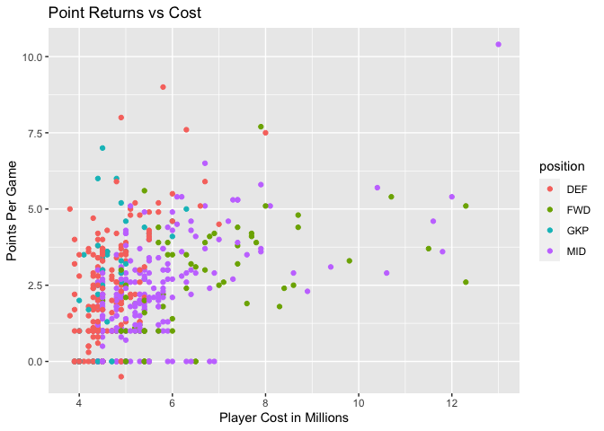

FPL Analytics
================

``` r
library(tidyverse)
```

    ## ── Attaching packages ─────────────────────────────────────── tidyverse 1.3.1 ──

    ## ✓ ggplot2 3.3.5     ✓ purrr   0.3.4
    ## ✓ tibble  3.1.5     ✓ dplyr   1.0.7
    ## ✓ tidyr   1.1.4     ✓ stringr 1.4.0
    ## ✓ readr   2.0.2     ✓ forcats 0.5.1

    ## ── Conflicts ────────────────────────────────────────── tidyverse_conflicts() ──
    ## x dplyr::filter() masks stats::filter()
    ## x dplyr::lag()    masks stats::lag()

## Welcome

Welcome to the fantasy world! See how you can manage a winning fantasy
team using these analytics to help guide your decision making.

## Is He Worth It?

<!-- -->

The above plot shows the relationship between the cost of a fantasy
player and their average points per game, colored by their position in
the team. A rather interesting observation we have here. Intuitively, we
would expect there to be a relatively strong relationship between the
cost of the player and the points they return each game. I mean, the
more value you return, the more you shoud cost, right? But that doesn’t
seem to be the case here. Or at least the relationship isn’t as strong
just by visualization. Interesting. So why spend more on a player that
returns the same value as one that costs less?

## Want More?

Stay tuned on the page to learn more!
